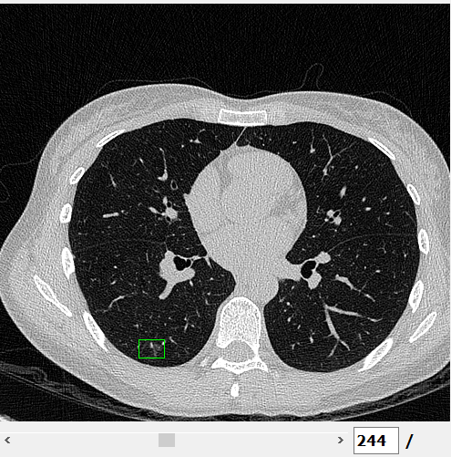

### Match GUI
#### Introduction
由於醫生提供的GT label 是 mask 的形式，因此我們需要將 mask 轉換成 bounding box 的形式，這樣才能進行訓練。我們使用3d cclabling演算法來將 mask 轉換成 bounding box 的形式。但由於mask是2d影像會發生連通性問題，因此會造成演算法無法正確的將mask轉換成bounding box。因此需要人工的方式去比對演算法轉換的bounding box是否正確。這個GUI的目的就是讓使用者可以比對演算法轉換的bounding box是否正確，並且可以進行修正。
以下我將醫生標記的GT label稱作 **nodule**，編號以醫生的標記檔**lung_M_class_0001-1800.xlsx**為準, 3d cclabling演算法轉換的bounding box稱作 **bbox**。這個程式的目的是讓使用者可以比對 nodule 和 bbox 的對應關係，包含類別、位置、大小等等，==主要以bbox對應的到為主==。
#### Question
目前根據統計nodule和bbox的對應會有幾種請況:
1. bbox和nodle的對應是一對一的關係
2. bbox和nodle的對應是一對多的關係
3. bbox和nodle的對應是多對一的關係

##### Analysis
1. bbox和nodle的對應是一對一的關係
    1. 這種情況是最理想的，代表演算法轉換的bbox是正確的。
2. bbox和nodle的對應是多對一的關係
    1. 因為mask是2d影像，slice之間的聯通性，導致演算法轉換的bbox會有多個(多個大個bbox)。這種情況需要人工的方式去比對，將對應的bbox合併成一個。
    2. 同一個slice同一個nodule會有多個bbox的情況(一個大的bbox，多個小bbox)，這種情況需要人工的方式去比對，刪除不正確的bbox。
3. bbox和nodle的對應是一對多的關係
    1. 這種情況是最不理想的，代表醫生可能將一個nodule分成兩個nodule去做標記。這種情況可能要請醫生確認

##### Example
1. 一個bbox對應到一個nodule
2. 多個bbox對應到一個nodule
    1. 以病人**0014**為例
    nodule 0, start slice->231
    
    bbox 0, slice->231-243
    
    bbox 1, slice->244-258
    
    >觀察 slice 243, 244可以發現mask不連續部分，導致bbox 0, bbox 1對應到同一個nodule
    
    
    2. 以病人**0256**為例
    nodule 0, start slice->163
    
    bbox 0, slice->163-172
    
    bbox 1, slice->170-172
    
    bbox 2, slice->167-169
    
    
    >可以發現bbox 0, bbox 1, bbox 2對應到同一個nodule，bbox 1, bbox 2明顯是錯誤的應該刪除
3. 一個bbox對應到多個nodule
    1. 以病人**0170**為例
    nodule 1, start slice->273
    
    nodule 0, start slice->276
    
    bbox 0, slice->270-278
    
    > 可以發現nodule 0, nodule 1應該被視為同一個
### GUI
#### 前置作業

#### 使用方式
我將bbox根據上面定義的問題應該要對應的操作分成四個部分:
1. Match-> 一個bbox對應到一個nodule
2. Combine-> 多個bbox合併成一個bbox
3. Delete-> 刪除不正確的bbox
4. Other-> 出現了沒有被定義的問題

##### Example
question 2.1
- 病人**0014**的bbox 0 應該和 bbox 1 合併
1. bbox 0 對應到 nodule 0

2. bbox 1 和 bbox 0 合併

> bbox 0 和 bbox 1 合併還是bbox 1 和 bbox 0 合併是一樣的
question 2.2
- 病人**0256**的bbox 1, bbox 2 應該刪除
1. bbox 0 對應到 nodule 0

2. bbox 1 和 bbox 2 刪除

